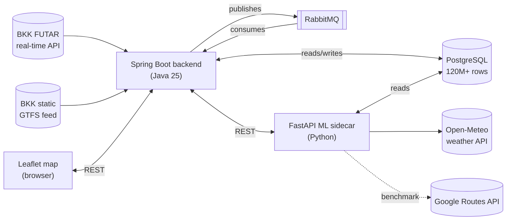

# BKK Live Transit & Delay Prediction

A real-time public transit tracker and machine-learning delay predictor for Budapest's transit network (BKK), built on BKK's own open real-time and static data. Live vehicle positions on a map, a model that predicts how late a vehicle will be at its next stop, and an accuracy scoreboard that grades the model against reality as it goes — plus a benchmark against Google Maps' own transit ETA on real trips.

Started as a portfolio project for internship applications; grew into a genuine polyglot microservices system (Java backend, Python ML sidecar, message-queue ingestion pipeline, Docker Compose) with over a million real accumulated vehicle observations behind it.

## Live demo

**Link:** *(paste the current tunnel URL here before sharing — `cloudflared tunnel --url http://localhost:8080`, a fresh one each time it's started)*

A two-minute guided tour, in order:

1. **The map itself** — every BKK vehicle currently running, positions updating every 10 seconds. Dots are colored by *real-time delay severity* (blue → green → yellow → orange → red), not vehicle type — glance at the map and you can already tell which parts of the city are having a rough moment, before clicking anything.
2. **Click any vehicle** — its predicted delay for the *next* stop, right next to its last *confirmed* delay (real GPS data from a minute ago). The two usually track closely — a visible sign the model is reacting to what this specific vehicle is actually doing right now, not reciting a generic route average.
3. **Bottom-left legend** — the color scale.
4. **Top-right "Live model accuracy" panel** — a real, continuously-updating scoreboard: every prediction gets logged, then automatically graded against reality once the vehicle actually reaches that stop. Not a canned demo number — it updates while you watch.
5. **The one to say out loud:** this model beats Google Maps' own transit ETA on real Budapest trips — **~58s average error vs. Google's ~312s**, closer to the real outcome in **68%** of head-to-head comparisons, verified on 189 real reconciled predictions (see "External validation" below for how that comparison was built and debugged).

## What it does

- **Live map** — every BKK bus, tram, trolleybus, and suburban rail vehicle currently running, updated every 10 seconds, color-coded by real-time delay severity.
- **Delay prediction** — click any vehicle to see a predicted delay for its upcoming stop, alongside its last *confirmed* delay (real ground truth) for an easy sanity check.
- **Live accuracy scoreboard** — a running, continuously-updating measure of how accurate the model's predictions actually turn out to be, reconciled against real outcomes as vehicles reach their stops.
- **External validation** — every prediction is also benchmarked against Google's own Routes API transit ETA for the same real trip, not just against a dumb internal baseline.

## Architecture



Two independently-deployable services talking over HTTP, both containerized (Docker Compose), both reaching a shared Postgres instance — a deliberately polyglot design (Java for the real backend, Python for the ML sidecar) rather than a single-language shortcut.

## Stack

| Layer | Choice | Why |
|---|---|---|
| Backend API | Java 25 + Spring Boot 4.1 | Matches target companies' stacks (Wise-style fintech backends); relational GTFS data suits a typed, structured backend |
| Database | PostgreSQL 17 | GTFS (stops/routes/trips/schedules) is inherently relational, not document-shaped |
| Message broker | RabbitMQ | Real producer→exchange→queue→consumer AMQP model, not a shortcut default-exchange |
| ML sidecar | Python + FastAPI + scikit-learn | Model training/serving where Python's ecosystem (pandas, scikit-learn) actually earns its place |
| Orchestration | Docker Compose | Backend + sidecar + broker containerized; Postgres deliberately left as a native service (see below) |
| Frontend | Leaflet + vanilla JS | No framework needed for a single live map page |

## The six build stages

1. **Static ingest** — Spring Boot + Postgres + BKK's static GTFS feed (stops, routes) → a working REST API.
2. **Live map** — real-time vehicle positions from BKK's FUTAR API, proxied server-side (API key never reaches the browser), rendered on Leaflet.
3. **Real-time ingestion pipeline** — a scheduled poller publishes every vehicle sighting through RabbitMQ to a Postgres-backed history table, running continuously.
4. **Delay-prediction sidecar** — a Python/FastAPI service that builds ground-truth delay labels from the accumulated history and serves live predictions.
5. **Feature engineering + external validation** — iterating on what actually predicts delay, and proving it against a real outside benchmark.
6. **Docker Compose** — the backend, sidecar, and broker all containerized with `restart: unless-stopped`, so the stack survives a reboot without manual relaunching.

## Engineering stories worth knowing (not just "it works")

### Building ground truth instead of trusting a vendor's prediction

The label isn't sourced from BKK's own `predictedArrivalTime` field. Instead: a vehicle reported `STOPPED_AT` a stop at 100% of the way there is treated as a real, physical "arrived here, now" event. That gets joined against the *static* GTFS schedule (on `trip_id` + `stop_sequence`) to compute `delay = actual_arrival − scheduled_arrival` — a ground-truth label built from raw telemetry, not relayed from someone else's black box.

### The walk-forward validation catch

The first model comparison used a single chronological 80/20 split and declared gradient-boosted trees the clear winner. Once more data accumulated, the *same* single-split approach suddenly showed GBT losing to a dumb per-route average — because the one split had, by chance, put a weekend-heavy period in training and a weekday-rush period in validation: two different traffic regimes. The fix was walk-forward validation (train on every earlier day, validate on each subsequent day in turn, average across all folds) — the same idea time-series backtesting uses, and it directly exposed *why* GBT was untrustworthy at low data volumes (a fold-by-fold train→validation gap of hundreds of seconds on thin-data days), not just *that* it scored worse on one lucky/unlucky split.

### The stale-schedule bug

Wiring the Spring Boot backend to actually call the prediction sidecar surfaced a live vehicle whose prediction inexplicably came back "unavailable." Root-caused rather than shrugged off: the downloaded static GTFS schedule was **9 days expired** (BKK's own file declared validity through Sep 3; the check happened Sep 12). The live-vs-static trip ID match rate showed the smoking gun — 73–77% through Aug 31, then a *cliff* to 25–43% starting exactly Sep 1, not gradually and not on the declared Sep 3 expiry date: the signature of a mid-season schedule swap (Hungarian schools start term Sep 1; BKK publishes a distinct school-year schedule), not gradual staleness. Re-downloading the current feed confirmed it: version dated literally the day of the check. This had been silently degrading training data for the prior week and a half, not just blocking the new feature — fixing it more than doubled the usable labeled dataset (2.6M → 6.1M rows).

### Feature engineering, one variable at a time

Rather than guessing at improvements, each one was measured in isolation against the walk-forward benchmark before moving to the next:

| Change | Result |
|---|---|
| Baseline (route/stop/time-of-day only) | ~94–104s MAE, and more data alone barely moved this ratio — a sign of a feature ceiling, not a data-volume problem |
| **Upstream delay** — this trip's own delay at its last observed stop | **~101s → ~58s MAE (≈45% reduction)** — delay propagates, and a vehicle's own recent state is far more informative than a historical average |
| Weather (Open-Meteo, temperature/precipitation/wind) | ~56s → ~53s — real but modest, as expected once the dominant signal was already captured |
| Route-level live delay (for a trip's first observed stop, which has no upstream reading yet) | Closed the *coverage* gap (0% → 99.8% of previously-blind rows) but not the *accuracy* gap (still ~150s vs ~36s MAE on those rows) — an honestly-reported partial result, not oversold as a fix |
| `deviated` flag (BKK's own off-route indicator) | Real per-row signal, but only 0.09% of rows are ever flagged — too rare to move an aggregate metric |

Current production model: **gradient-boosted trees, ~53s mean absolute error** (walk-forward validated), down from ~110s for a naive per-route historical average.

### External validation: benchmarking against Google Maps

Beating an internal dumb baseline is a low bar. The real test: for the same real vehicle, right now, is this model's prediction closer to what actually happened than Google Maps' own live transit ETA? Building this surfaced three genuine measurement bugs, each one found by refusing to accept a suspicious number at face value:

1. Querying Google for a vehicle's *immediate* next stop returned no transit route at all — Google correctly judges that walking one more stop is often faster than waiting to reboard. Fixed by comparing against a stop several stops further down the same trip.
2. The first attempted fix for wildly-inflated Google numbers (480s, 840s+) was mathematically a no-op — confirmed by algebra, not just by the numbers staying identical. The real cause: querying from a live GPS point with `departureTime="now"` let Google assume a fresh rider who might board a materially *later* run of the same line — a different real-world service instance than the one being tracked. Fixed by anchoring the query to a stop the trip had *already departed*, with that specific trip's real departure time.
3. A smaller residual case: one sample's *scheduled* departure was 9 minutes *after* the query was made — a scheduled layover in the timetable, unrelated to when the real vehicle actually left. Fixed by preferring the real observed departure time (already being tracked) over the static schedule.

**Result, on 189 real reconciled comparisons:** this model's mean absolute error is **~58s**, versus **~312s** for Google's Routes API on the same trips — closer to the actual outcome in **68%** of head-to-head comparisons. (Google's Transit mode also has no way to request a specific route/line — confirmed against the actual API schema, not assumed — so match rate is inherently bounded by Budapest's route overlap; comparisons are kept strict, exact-route-only, since loosening them would mean validating against a different vehicle than the one whose real outcome is known.)

## Scale

- **120M+** vehicle position snapshots collected via the real-time ingestion pipeline.
- **6.7M+** labeled (features, delay) training rows built from that history.
- Continuous operation since late August 2026, surviving multiple reboots via Docker's `restart: unless-stopped`.

## Running it locally

```bash
# 1. Build the backend jar (host Maven, not a Docker build stage - see bkk-backend/Dockerfile)
cd bkk-backend && mvn -DskipTests package && cd ..

# 2. Have a trained model at bkk-delay-service/models/delay_model.joblib
#    (run bkk-delay-service/scripts/train_model.py first if not)

# 3. Set required env vars: BKK_API_KEY, DB_PASSWORD (native Postgres)

# 4. Bring up the backend + sidecar + broker
docker compose up --build -d
```

Postgres itself runs natively (a Windows/Linux service), not in Compose — see `docker-compose.yml`'s header comment for why: it already survives reboots on its own, and containerizing it would mean migrating tens of millions of real accumulated rows for a mostly cosmetic "one compose file" story.

## Known limitations

- Cold-start prediction (a trip's very first observed stop, ~7% of cases) is measurably worse than mid-trip prediction — a likely structural limit without a new data source (e.g. dispatch/shift-start data).
- No automated test suite yet.
- Volánbusz/MÁV-START vehicles that appear in BKK's live feed (~3%, a different agency) aren't matched against their own schedules — a legitimate low-priority backlog item, not a bug.
