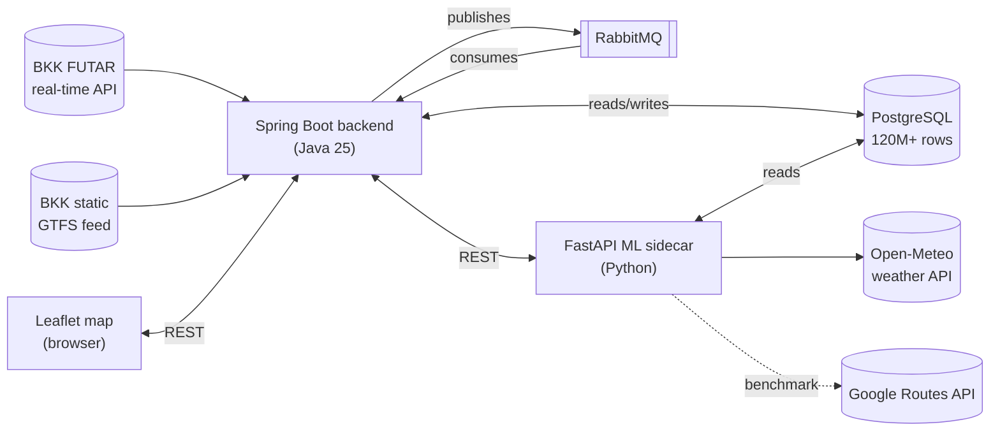

# BKK Live Transit & Delay Prediction

A real-time public transit tracker and machine-learning delay predictor for Budapest's transit network (BKK), built on BKK's own open real-time and static data. Live vehicle positions on a map, a model that predicts how late a vehicle will be at its next stop, and an accuracy scoreboard that grades the model against reality as it goes — plus a benchmark against Google Maps' own transit ETA on real trips.

Started as a portfolio project for internship applications; grew into a genuine polyglot microservices system (Java backend, Python ML sidecar, message-queue ingestion pipeline, Docker Compose) with over a million real accumulated vehicle observations behind it.

## Live demo

**Link:** *(paste the current tunnel URL here before sharing — `cloudflared tunnel --url http://localhost:8080`, a fresh one each time it's started)*

A two-minute guided tour, in order:

1. **The map itself** — every BKK vehicle currently running, positions updating every 10 seconds. Dots are colored by *real-time delay severity* (blue → green → yellow → orange → red), not vehicle type — glance at the map and you can already tell which parts of the city are having a rough moment, before clicking anything.
2. **Click any vehicle** — its predicted delay for the *next* stop, right next to its last *confirmed* delay (real GPS data from a minute ago). The two usually track closely — a visible sign the model is reacting to what this specific vehicle is actually doing right now, not reciting a generic route average.
3. **Bottom-left legend** — the color scale.
4. **Top-right "Live model accuracy" panel** — a real, continuously-updating scoreboard: every prediction gets logged, then automatically graded against reality once the vehicle actually reaches that stop. Not a canned demo number — it updates while you watch.
5. **The one to say out loud:** this model beats Google Maps' own transit ETA on real Budapest trips — **~66s average error vs. Google's ~327s**, closer to the real outcome in **69%** of head-to-head comparisons, verified on 203 real reconciled predictions (see "External validation" below for how that comparison was built and debugged, and why "we beat Google" isn't quite the right way to frame it).

## What it does

- **Live map** — every BKK bus, tram, trolleybus, and suburban rail vehicle currently running, updated every 10 seconds, color-coded by real-time delay severity.
- **Delay prediction** — click any vehicle to see a predicted delay for its upcoming stop, alongside its last *confirmed* delay (real ground truth) for an easy sanity check.
- **Live accuracy scoreboard** — a running, continuously-updating measure of how accurate the model's predictions actually turn out to be, reconciled against real outcomes as vehicles reach their stops.
- **External validation** — every prediction is also benchmarked against Google's own Routes API transit ETA for the same real trip, not just against a dumb internal baseline.

## Architecture


```mermaid
flowchart LR
    BKK[("BKK FUTAR\nreal-time API")] --> Java
    GTFS[("BKK static\nGTFS feed")] --> Java
    Java["Spring Boot backend\n(Java 25)"] -->|publishes| MQ[["RabbitMQ"]]
    MQ -->|consumes| Java
    Java <-->|reads/writes| PG[("PostgreSQL\n120M+ rows")]
    Java <-->|REST| Sidecar["FastAPI ML sidecar\n(Python)"]
    Sidecar <-->|reads| PG
    Sidecar --> Weather[("Open-Meteo\nweather API")]
    Sidecar -.benchmark.-> Google[("Google Routes API")]
    Browser["Leaflet map\n(browser)"] <-->|REST| Java
```

Two independently-deployable services talking over HTTP, both containerized (Docker Compose), both reaching a shared Postgres instance — a deliberately polyglot design (Java for the real backend, Python for the ML sidecar) rather than a single-language shortcut.

## Stack

| Layer | Choice | Why |
|---|---|---|
| Backend API | Java 25 + Spring Boot 4.1 | Matches target companies' stacks (Wise-style fintech backends); relational GTFS data suits a typed, structured backend |
| Database | PostgreSQL 17 | GTFS (stops/routes/trips/schedules) is inherently relational, not document-shaped |
| Message broker | RabbitMQ | Real producer→exchange→queue→consumer AMQP model, not a shortcut default-exchange |
| ML sidecar | Python + FastAPI + scikit-learn | Model training/serving where Python's ecosystem (pandas, scikit-learn) actually earns its place |
| Orchestration | Docker Compose | Backend + sidecar + broker containerized; Postgres deliberately left as a native service (see below) |
| Frontend | Leaflet + vanilla JS | No framework needed for a single live map page |

## The six build stages

1. **Static ingest** — Spring Boot + Postgres + BKK's static GTFS feed (stops, routes) → a working REST API.
2. **Live map** — real-time vehicle positions from BKK's FUTAR API, proxied server-side (API key never reaches the browser), rendered on Leaflet.
3. **Real-time ingestion pipeline** — a scheduled poller publishes every vehicle sighting through RabbitMQ to a Postgres-backed history table, running continuously.
4. **Delay-prediction sidecar** — a Python/FastAPI service that builds ground-truth delay labels from the accumulated history and serves live predictions.
5. **Feature engineering + external validation** — iterating on what actually predicts delay, and proving it against a real outside benchmark.
6. **Docker Compose** — the backend, sidecar, and broker all containerized with `restart: unless-stopped`, so the stack survives a reboot without manual relaunching.

## Engineering stories worth knowing (not just "it works")

### Building ground truth instead of trusting a vendor's prediction

The label isn't sourced from BKK's own `predictedArrivalTime` field. Instead: a vehicle reported `STOPPED_AT` a stop at 100% of the way there is treated as a real, physical "arrived here, now" event. That gets joined against the *static* GTFS schedule (on `trip_id` + `stop_sequence`) to compute `delay = actual_arrival − scheduled_arrival` — a ground-truth label built from raw telemetry, not relayed from someone else's black box.

### The walk-forward validation catch

The first model comparison used a single chronological 80/20 split and declared gradient-boosted trees the clear winner. Once more data accumulated, the *same* single-split approach suddenly showed GBT losing to a dumb per-route average — because the one split had, by chance, put a weekend-heavy period in training and a weekday-rush period in validation: two different traffic regimes. The fix was walk-forward validation (train on every earlier day, validate on each subsequent day in turn, average across all folds) — the same idea time-series backtesting uses, and it directly exposed *why* GBT was untrustworthy at low data volumes (a fold-by-fold train→validation gap of hundreds of seconds on thin-data days), not just *that* it scored worse on one lucky/unlucky split.

### The stale-schedule bug

Wiring the Spring Boot backend to actually call the prediction sidecar surfaced a live vehicle whose prediction inexplicably came back "unavailable." Root-caused rather than shrugged off: the downloaded static GTFS schedule was **9 days expired** (BKK's own file declared validity through Sep 3; the check happened Sep 12). The live-vs-static trip ID match rate showed the smoking gun — 73–77% through Aug 31, then a *cliff* to 25–43% starting exactly Sep 1, not gradually and not on the declared Sep 3 expiry date: the signature of a mid-season schedule swap (Hungarian schools start term Sep 1; BKK publishes a distinct school-year schedule), not gradual staleness. Re-downloading the current feed confirmed it: version dated literally the day of the check. This had been silently degrading training data for the prior week and a half, not just blocking the new feature — fixing it more than doubled the usable labeled dataset (2.6M → 6.1M rows).

### Feature engineering, one variable at a time

Rather than guessing at improvements, each one was measured in isolation against the walk-forward benchmark before moving to the next:

| Change | Result |
|---|---|
| Baseline (route/stop/time-of-day only) | ~94–104s MAE, and more data alone barely moved this ratio — a sign of a feature ceiling, not a data-volume problem |
| **Upstream delay** — this trip's own delay at its last observed stop | **~101s → ~58s MAE (≈45% reduction)** — delay propagates, and a vehicle's own recent state is far more informative than a historical average |
| Weather (Open-Meteo, temperature/precipitation/wind) | ~56s → ~53s — real but modest, as expected once the dominant signal was already captured |
| Route-level live delay (for a trip's first observed stop, which has no upstream reading yet) | Closed the *coverage* gap (0% → 99.8% of previously-blind rows) but not the *accuracy* gap (still ~150s vs ~36s MAE on those rows) — an honestly-reported partial result, not oversold as a fix |
| `deviated` flag (BKK's own off-route indicator) | Real per-row signal, but only 0.09% of rows are ever flagged — too rare to move an aggregate metric |

Current production model: **gradient-boosted trees, ~53s mean absolute error** (walk-forward validated), down from ~110s for a naive per-route historical average.

### External validation: benchmarking against Google Maps

Beating an internal dumb baseline is a low bar. The real test: for the same real vehicle, right now, is this model's prediction closer to what actually happened than Google Maps' own live transit ETA? Building this surfaced three genuine measurement bugs, each one found by refusing to accept a suspicious number at face value:

1. Querying Google for a vehicle's *immediate* next stop returned no transit route at all — Google correctly judges that walking one more stop is often faster than waiting to reboard. Fixed by comparing against a stop several stops further down the same trip.
2. The first attempted fix for wildly-inflated Google numbers (480s, 840s+) was mathematically a no-op — confirmed by algebra, not just by the numbers staying identical. The real cause: querying from a live GPS point with `departureTime="now"` let Google assume a fresh rider who might board a materially *later* run of the same line — a different real-world service instance than the one being tracked. Fixed by anchoring the query to a stop the trip had *already departed*, with that specific trip's real departure time.
3. A smaller residual case: one sample's *scheduled* departure was 9 minutes *after* the query was made — a scheduled layover in the timetable, unrelated to when the real vehicle actually left. Fixed by preferring the real observed departure time (already being tracked) over the static schedule.

**Result, on 203 real reconciled comparisons:** this model's mean absolute error is **~66s**, versus **~327s** for Google's Routes API on the same trips — closer to the actual outcome in **69%** of head-to-head comparisons. (Google's Transit mode also has no way to request a specific route/line — confirmed against the actual API schema, not assumed — so match rate is inherently bounded by Budapest's route overlap; comparisons are kept strict, exact-route-only, since loosening them would mean validating against a different vehicle than the one whose real outcome is known.)

**Why this isn't really "beating Google":** Google's API is solving a different, harder problem — trip planning for a hypothetical fresh rider at any of thousands of agencies worldwide, without a live relationship to any one specific vehicle. This project tracks one specific transit network's live AVL feed at 15s resolution and knows exactly which physical vehicle is being asked about, its own recent delay, current weather, and the route's recent history — a narrower question with far more contextual signal. The honest framing is "a specialist system with dedicated telemetry for one network outperforms a generalist global router on that network's own vehicle-level predictions," not "beats Google Maps" as a general claim.

### A live metric that quietly stopped working, and a wrong first fix along the way

The map's live accuracy panel disappeared. `EXPLAIN ANALYZE` on the reconciliation query showed why: `vehicle_position_snapshots` had grown to 132M rows, and the only index available (`trip_id` alone) wasn't selective enough anymore — each request pulled ~1,400 candidate rows off disk per logged prediction just to filter the rest by hand, 580K+ buffer reads, 52 seconds end to end. Fixed with a composite partial index built `CONCURRENTLY` against the live table (zero downtime, ingestion never paused) — 52s → 0.2s.

That surfaced a second, subtler problem: the live rolling MAE had jumped from ~36s to ~106s. First instinct was to reuse the outlier threshold already established in the training pipeline (`|delay| > 3600s`) — rebuilt, retested, and the number barely moved. **Wrong fix, caught by re-measuring instead of trusting the reasoning:** both actual outlier values (1906s, 2220s) were comfortably under that 3600s bound, which was calibrated for a multi-million-row training corpus, not a 50-sample live display. Re-diagnosed properly by pulling the full delay distribution across all reconciled predictions (p99 ≈ 807s, with a genuine gap before the next value at 1906s) and picking a threshold from that evidence instead of guessing twice. Confirmed via direct inspection of the raw snapshot timestamps that both flagged cases showed the concrete signature of a mismatched reconciliation (BKK reusing a `trip_id` for an unrelated dispatch), not a real model regression. MAE: 106s → 35.75s.

### A cross-language bug that looked like a networking mystery

Wiring the Java backend to call the Python sidecar over plain HTTP, every POST request came back corrupted — but only from Java, never from `curl`. Root cause, found in uvicorn's own log line ("Unsupported upgrade request") rather than guessed: Java's `RestClient` (backed by the JDK's `HttpClient`) was silently attempting an HTTP/2 cleartext ("h2c") upgrade against a plain HTTP service that only speaks HTTP/1.1 — something BKK's own HTTPS endpoint never triggered, since TLS negotiates the protocol version cleanly. Fixed by pinning the request factory to HTTP/1.1 explicitly. A reminder that "it works for the other service" doesn't mean the protocol assumptions are the same underneath.

### Finding an undocumented API limit by testing it, not assuming it

The live map only ever showed traffic within a 6km radius — an arbitrary starting choice, never actually validated. Testing BKK's real-time API directly at increasing radii showed vehicle counts still climbing well past 6km (622 → 1,485 at 15km → 1,714 at 25km) — the original radius was badly under-covering the city. Kept probing until BKK's API returned `LIMIT_EXCEEDED` somewhere between 25km and 28km — a hard cap that isn't documented anywhere BKK publishes, confirmed as a real limit rather than rate-limiting by spacing out retries. Landed on 25km, safely under the cap — nearly 3x the live vehicle coverage, discovered by testing the actual system instead of trusting the original guess.

## Scale

- **132M+** vehicle position snapshots collected via the real-time ingestion pipeline (31GB).
- **6.7M+** labeled (features, delay) training rows built from that history.
- Continuous operation since late August 2026, surviving multiple reboots via Docker's `restart: unless-stopped`.

## Data & license

Static schedule (GTFS) and real-time vehicle/trip/alert data are provided by BKK Zrt. under [CC BY 4.0](https://creativecommons.org/licenses/by/4.0/deed.en) — free to use, share, and build on (including commercially or academically), with one condition: attribution.

> Data source: BKK Zrt., CC BY 4.0

If any part of this project (data, findings, or figures) is reused elsewhere — a thesis included — carry that same attribution line with it.

## Running it locally

```bash
# 1. Build the backend jar (host Maven, not a Docker build stage - see bkk-backend/Dockerfile)
cd bkk-backend && mvn -DskipTests package && cd ..

# 2. Have a trained model at bkk-delay-service/models/delay_model.joblib
#    (run bkk-delay-service/scripts/train_model.py first if not)

# 3. Set required env vars: BKK_API_KEY, DB_PASSWORD (native Postgres)

# 4. Bring up the backend + sidecar + broker
docker compose up --build -d
```

Postgres itself runs natively (a Windows/Linux service), not in Compose — see `docker-compose.yml`'s header comment for why: it already survives reboots on its own, and containerizing it would mean migrating tens of millions of real accumulated rows for a mostly cosmetic "one compose file" story.

## Known limitations

- Cold-start prediction (a trip's very first observed stop, ~7% of cases) is measurably worse than mid-trip prediction — a likely structural limit without a new data source (e.g. dispatch/shift-start data).
- No automated test suite yet.
- Volánbusz/MÁV-START vehicles that appear in BKK's live feed (~3%, a different agency) aren't matched against their own schedules — a legitimate low-priority backlog item, not a bug.

## Changelog

Notable fixes and changes, most recent first (full history: `git log`).

- **2026-09-16** — A suspected memory leak in the delay-service turned out to be OpenBLAS/OpenMP allocating a per-thread scratch arena per logical core (12) on import — never real RAM (working set stayed flat at 151MB regardless of thread count), but the 12-thread default was adding pure thread-pool sync overhead on every single-row `/predict` call. Capped to 1 thread via env vars: ~27% lower median latency, ~35% lower p95.
- **2026-09-16** — Two identical predictions could be logged for the exact same real arrival (a vehicle's popup reopened just after the 15s frontend prediction cache expired), double-weighting that one event in the scoreboard's 50-sample average. Confirmed via data (9 duplicate groups, all 16-142s apart - a double-click pattern, not genuinely separate re-predictions) before fixing; deduped to the latest prediction per (trip, stop, date). MAE: 58.9s → 53.7s on the affected window.
- **2026-09-16** — The map's "last confirmed delay: n/a (first observed stop on this trip)" message was often false - confirmed live vehicles sitting at stop 15-25+ with zero earlier confirmed stops in our data. The code only knows "we never confirmed an earlier stop," not "this is truly the trip's first stop" (most likely a relief vehicle picking up a trip already in progress, or a polling gap - tested and ruled out the tracking radius as the cause). Reworded to "no earlier reading available today."
- **2026-09-16** — Vehicles BKK hasn't linked to any scheduled trip (almost always deadheading — destination sign reads "nem szállít utasokat" / "kocsiszínbe") were rendered identically to real in-service vehicles just waiting on a delay reading. Traced the pattern in Postgres (~89% of vehicles ever seen without a `tripId` get a real one later the same day — same fleet cycling in and out of service, not a broken subset) and gave them a distinct, paler marker plus a plain-language popup line.
- **2026-09-16** — Removed the unused `POST /api/stops` endpoint: dead code left over from an early Jackson-deserialization teaching example, never called by anything real, and a latent unauthenticated write on a LAN-exposed API.
- **2026-09-16** — Live accuracy scoreboard's rolling 50-sample MAE was being dominated by 1-2 mismatched reconciliations (BKK reusing a `trip_id` for more than one real dispatch/schedule instance) rather than reflecting real model performance. Added an outlier guard chosen from the actual delay distribution (p99 ≈ 807s, with a genuine gap before the next value at 1906s) rather than an arbitrary cutoff.
- **2026-09-16** — `/scoreboard` was silently timing out (~52s) once `vehicle_position_snapshots` crossed ~130M rows — a missing composite index meant every reconciliation lookup scanned roughly 1,400 rows per prediction by hand. Added a partial composite index (self-provisioning on startup, so a fresh deployment gets it automatically) — 52s → 0.2s.
- **2026-09-16** — Reframed the Google Maps benchmark as elapsed travel time instead of absolute delay-vs-schedule (Google's `arrivalTime` can reflect a different real departure than the one being tracked). First real numbers at scale: 66.2s MAE vs. Google's 326.9s, 69% win rate over 203 reconciled comparisons.
- **2026-09-15** — Fixed `/scoreboard` matching predictions against a stale, pre-prediction arrival when BKK reuses a `trip_id` for more than one real dispatch on the same service date.
- **2026-09-15** — Map popup showed raw feed IDs (`BKK_F00969`) instead of real stop names.
- **2026-09-14** — Building the Google Routes API benchmark surfaced three real measurement bugs, each found by refusing to accept a suspicious number at face value: querying a vehicle's *immediate* next stop returned no transit route (fixed by comparing several stops further down the trip); a first attempted fix for wildly-inflated Google numbers turned out to be mathematically a no-op, the real cause was Google assuming a fresh rider who might board a *later* run of the same line (fixed by anchoring the query to a stop the trip had already departed); and a scheduled-but-not-actual departure time threw off a handful of samples (fixed by preferring the real observed departure). See "External validation" below for the full story.
- **2026-09-14** — Three delay-prediction features added and measured one at a time: weather (56.1s → 53.3s MAE), route-level live delay for cold-start trips (closed the coverage gap, didn't close the accuracy gap on those rows), and BKK's own `deviated` flag (real per-row signal, too rare to move the aggregate).
- **2026-09-12** — Added the upstream-delay feature (this trip's own delay at its last observed stop) - the single biggest accuracy win of the project, roughly halving prediction error (101.4s → 57.7s MAE).
- **2026-09-12** — Java's `RestClient` was silently corrupting every POST to the Python sidecar by attempting an HTTP/2 cleartext ("h2c") upgrade that uvicorn doesn't support. Found via uvicorn's own "Unsupported upgrade request" log line; fixed by pinning the request factory to HTTP/1.1.
- **2026-09-12** — Diagnosed a live "prediction unavailable" bug back to a **9-days-expired static GTFS schedule** — live-vs-static trip ID match rate showed a cliff from ~75% to ~25-43% starting exactly Sep 1 (a mid-season schedule swap, not gradual staleness). Re-downloading the current feed doubled the usable labeled dataset (2.6M → 6.1M rows) — the bug had been silently degrading training data too, not just blocking the new feature.
- **2026-09-09** — RabbitMQ container wasn't surviving reboots (no restart policy, unlike Docker Desktop itself which auto-launches at login). Fixed with `docker update --restart unless-stopped`.
- **2026-09-01** — A larger retrain exposed gradient-boosted trees losing to a dumb per-route baseline — root-caused to a single lucky/unlucky chronological train/val split putting a weekend-heavy period in training and a weekday-rush period in validation. Fixed by reworking evaluation to walk-forward validation (expanding window, one fold per day) instead of trusting one split.
- **2026-08-29** — Delay-label outliers (min ≈ -11529s, max ≈ +12837s) traced to BKK reusing a `trip_id` for a real dispatch at a materially different time than the static schedule snapshot said — confirmed by finding 5+ consecutive stops on the same trip all shifted by one consistent offset. Fixed with a bounded `|delay| > 3600s` filter in the training pipeline once the mechanism was confirmed, not guessed.
- **2026-08-28** — BKK's live vehicle-position feed carries more fields than the static GTFS-derived pipeline was capturing (`deviated`, `stale`) — found via a direct field-by-field diff of BKK's raw response against what was stored. Added both once confirmed real and non-redundant.
- **2026-08-28** — Widened the live-vehicle polling radius from 6km to 25km after finding it was badly under-covering the city (622 → 1714 vehicles as radius increased) — also empirically found BKK's undocumented hard cap (`LIMIT_EXCEEDED` somewhere between 25-28km), since it's not published anywhere.
- **2026-08-28** — The original `vehicle_position_snapshots` schema only captured vehicleId/routeId/lat-lon/bearing - no `tripId`, `stopId`, or `status`, discovered by diffing BKK's raw response against what was actually stored. Without `tripId` there was no way to join a sighting back to a scheduled trip, so **no delay could ever have been computed from that data** - the root fix that unblocked all of stage 5.
- **2026-08-26** — Spring AMQP 4.1's `Jackson2JsonMessageConverter` crashed at startup (`NoClassDefFoundError`) because Boot 4.1 moved to Jackson 3, which doesn't have the classic `com.fasterxml.jackson.databind` classes it expects. Fixed by switching to the Jackson-3-native `JacksonJsonMessageConverter` spring-amqp ships alongside it.
- **2026-08-25** — The live map's vehicle-type coloring was silently broken: BKK's real-time feed reports `vehicleRouteType` as a descriptive string (`"TRAM"`, `"BUS"`) while the static GTFS feed uses numeric `route_type` codes (`"0"`, `"3"`) — found by curling the live endpoint directly rather than assuming they'd match.
- **2026-08-24** — Discovered the real-time API's `stopId` uses `BKK_` + the static feed's `stopCode` field, not `BKK_` + `stopId` — a real mismatch between the static and real-time ID schemes, found by trial and error against the live API.
- **2026-08-24** — Spring Boot 4.1 pulls in Jackson 3, which renamed its packages (`com.fasterxml.jackson.*` → `tools.jackson.*`) and split `RestClient` auto-configuration into its own opt-in starter — both newer than general training-data knowledge, diagnosed from actual error messages and `mvn dependency:tree`.
- **2026-08-24** — Externalized the hardcoded Postgres password to an environment variable (with a local-dev fallback) before the first public push, rather than shipping a plaintext credential to a public GitHub repo.
