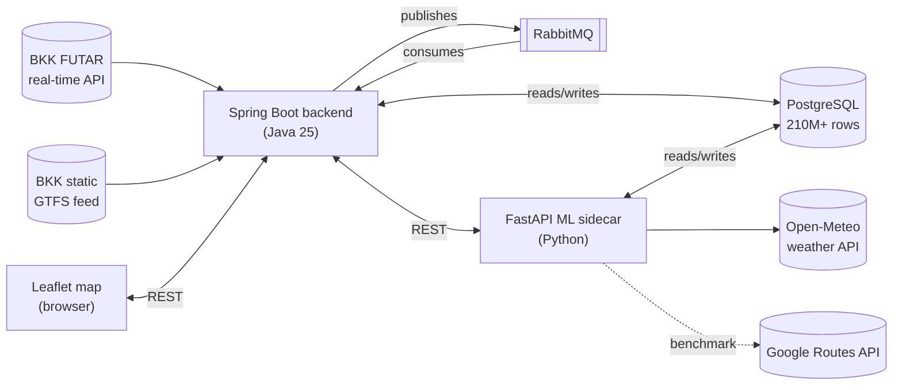

# BKK Live Transit & Delay Prediction

A real-time public transit tracker and machine-learning delay predictor for Budapest (BKK), built on BKK's own open real-time and static data. It shows live vehicle positions on a map, predicts how late each vehicle will be at its next stops, and grades every prediction against reality when the vehicle arrives.

Java (Spring Boot) backend, Python ML service, RabbitMQ ingestion pipeline, PostgreSQL, Docker Compose. Collecting data since 26 August 2026 (over 210 million vehicle position records). A live demo is available on request; it runs on my own machine, so there is no permanent public link.

## What it does

- **Live map** of every running BKK bus, tram, trolleybus and suburban railway vehicle, updated every 10 seconds and coloured by current delay.
- **Delay prediction** for a vehicle's upcoming stop (click any vehicle), next to its last confirmed delay.
- **Live accuracy scoreboard:** every next-stop prediction is graded when the vehicle arrives, against a "no model" baseline (assume the current delay stays the same).

## Results so far

Measured live, against what actually happened (as of 30 September 2026):

- **Next stop:** mean error **26.3 s** vs 34.1 s for the no-model baseline; 94.8% of predictions accurate by the MBTA arrival-prediction standard vs 90.4% (1.5 million graded predictions since 26 Sep).
- **Against BKK's own predictions,** on the same stop visit and the same moment: **23.8 s vs 28.8 s** (41,544 pairs over 4 days). At a random moment between stops BKK is still more accurate.
- **Further ahead** (3, 5 and 10 stops): **50.2 s vs 64.0 s** for keeping the current delay (812,000 graded predictions).
- Over 400,000 predictions are graded on a typical weekday.

## Architecture


```mermaid
flowchart LR
    BKK[("BKK FUTAR\nreal-time API")] --> Java
    GTFS[("BKK static\nGTFS feed")] --> Java
    Java["Spring Boot backend\n(Java 25)"] -->|publishes| MQ[["RabbitMQ"]]
    MQ -->|consumes| Java
    Java <-->|reads/writes| PG[("PostgreSQL\n210M+ rows")]
    Java <-->|REST| Sidecar["FastAPI ML sidecar\n(Python)"]
    Sidecar <-->|reads/writes| PG
    Sidecar --> Weather[("Open-Meteo\nweather API")]
    Sidecar -.benchmark.-> Google[("Google Routes API")]
    Browser["Leaflet map\n(browser)"] <-->|REST| Java
```

Two independently-deployable services talking over HTTP, both containerized (Docker Compose), both reaching a shared Postgres instance — a deliberately polyglot design (Java for the real backend, Python for the ML sidecar) rather than a single-language shortcut.

## Stack

| Layer | Choice |
|---|---|
| Backend API | Java 25 + Spring Boot 4.1 |
| Database | PostgreSQL 17 |
| Message broker | RabbitMQ |
| ML service | Python + FastAPI + scikit-learn |
| Orchestration | Docker Compose |
| Frontend | Leaflet + vanilla JS |

## Running it locally

```bash
# 1. Build the backend jar (host Maven, not a Docker build stage - see bkk-backend/Dockerfile)
cd bkk-backend && mvn -DskipTests package && cd ..

# 2. Have a trained model at bkk-delay-service/models/delay_model.joblib
#    (run bkk-delay-service/scripts/train_model.py first if not)

# 3. Set required env vars: BKK_API_KEY, DB_PASSWORD (native Postgres)

# 4. Bring up the backend + sidecar + broker
docker compose up --build -d
```

Postgres runs natively, not in Compose (the header comment in `docker-compose.yml` explains why).

## Known limitations

- Only data since late August 2026: no winter, no holidays yet.
- A trip's first observed stop (cold start) and departures from a first stop are the weakest cases; buses are less accurate than trams.
- Predictions several minutes ahead are much less accurate than the next stop. The longer-range predictions are not shown on the map yet.
- No automated test suite yet.

## Data & license

Static schedule (GTFS) and real-time vehicle/trip/alert data are provided by BKK Zrt. under [CC BY 4.0](https://creativecommons.org/licenses/by/4.0/deed.en) — free to use, share, and build on (including commercially or academically), with one condition: attribution.

> Data source: BKK Zrt., CC BY 4.0

If any part of this project (data, findings, or figures) is reused elsewhere — a thesis included — carry that same attribution line with it.

## More

- [ENGINEERING_NOTES.md](ENGINEERING_NOTES.md): demo tour, build stages, engineering stories, full limitations.
- [CHANGELOG.md](CHANGELOG.md): notable fixes and changes, most recent first.
